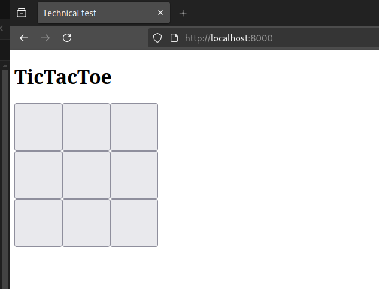
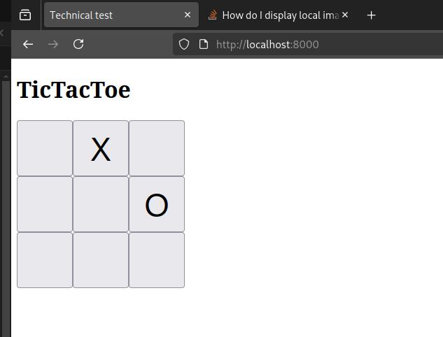

### Technical Test - TicTacToe 



When clicking on any button, there appears a mark X or O.

This is just a single player game. Computer will not play. You switch turns to mark X or O

Try clicking on the buttons at random and observe





# How to Run this locally
use python simple http server

open the project using vscode. in the terminal, run

```
python3 -m http.server 8000
```

open browser and navigate to url
```
http://localhost:8000
```

### Note: Everytime you change the code, you need to refresh the page in browser for the changes to reflect

to stop the server, you can use Ctrl+C in the terminal

# The Task

> **Task is to complete the isGameOver function in the script.js file**

Game is over if any of the following conditions are met:

1. Any row or column or diagonal is marked with the same letter - either all X or all O
2. All 9 buttons are marked

You have to return `true` or `false` from this function and the button click handler will show an alert message based on that.


#### Instructions
1. Fork the repo
2. Clone the repo to your computer
3. Open the project in vscode
4. Open the script.js file
5. Complete the isGameOver function
6. Test all scenarios
7. Push code to your fork
8. Send an email to me with the link to your fork


